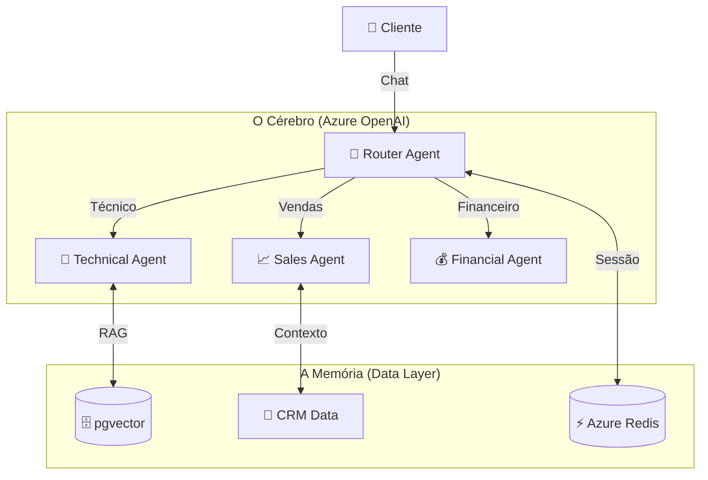

# 🚀 Central de Atendimento Inteligente | Microsoft Innovation Challenge 2025

<div align="center">


> *"A tecnologia é melhor quando aproxima as pessoas, mas a IA é melhor quando resolve os problemas delas."*

</div>

---

## 🎬 O Cenário (The Problem)

Imagine uma segunda-feira de manhã. A central de atendimento está em chamas.
Telefones tocando sem parar, filas de espera de 40 minutos e clientes furiosos no Twitter.
Os atendentes humanos, exaustos, gastam 80% do tempo respondendo: *"Senhor, já tentou reiniciar o modem?"* ou *"A segunda via está no seu e-mail"*.

Enquanto isso, os problemas reais — aqueles que exigem empatia, criatividade e negociação — ficam em segundo plano. O resultado? **Churn alto, NPS baixo e custos explodindo.**

---

## 💡 A Solução (The Innovation)

A **Central de Atendimento Inteligente** não é apenas mais um chatbot. É um **Orquestrador de Experiências** alimentado pelo estado da arte da IA Generativa no Azure.

Nós não substituímos o humano; nós o elevamos. Nossa IA assume o papel de "primeira linha de defesa" com uma capacidade cognitiva nunca antes vista, resolvendo o trivial instantaneamente e preparando o terreno para o complexo.

### ✨ Conheça o Time (Nossos Agentes)

Diferente de sistemas baseados em regras, nossa arquitetura utiliza **Agentes Autônomos Especializados**, cada um com uma "persona" e ferramentas próprias:

#### 1. 🐺 O Agente de Vendas ("The Wolf")
*   **Personalidade**: Persuasivo, proativo e focado em resultados. Inspirado nos maiores vendedores do mundo.
*   **Superpoder**: Ele não aceita um "não" facilmente. Se você tentar cancelar, ele vai entender sua dor, oferecer alternativas e, se necessário, sacar um desconto estratégico de 20% (calculado em tempo real) para te manter na base.
*   **Tech**: GPT-4o com *Temperature* ajustada para criatividade e persuasão.

#### 2. 🔧 O Agente Técnico ("The Engineer")
*   **Personalidade**: Metódico, preciso e paciente.
*   **Superpoder**: Memória Infinita. Ele leu todos os manuais técnicos da empresa. Se sua luz PON está piscando, ele sabe exatamente o que é, porque consultou a base de conhecimento vetorial em milissegundos.
*   **Tech**: **RAG (Retrieval-Augmented Generation)** com `pgvector` e Azure OpenAI Embeddings.

---

## 🏛 Sob o Capô (Architecture)

Construído sobre a robustez do **Microsoft Azure**, nossa arquitetura é modular, assíncrona e escalável.



### Stack Tecnológica
*   **Backend**: Python 3.12 + FastAPI (AsyncIO puro para alta performance).
*   **IA**: Azure OpenAI (GPT-4o, GPT-4o-mini, text-embedding-3-small).
*   **Banco de Dados**: PostgreSQL 14 com extensão `vector` para busca semântica.
*   **Frontend**: React 19 + Vite (Interface moderna e responsiva).
*   **DevOps**: Docker & GitHub Actions (CI/CD automatizado).

---

## 🚀 Como Rodar (Quickstart)

Quer ver a mágica acontecer? É simples.

### Pré-requisitos
*   Docker & Docker Compose
*   Uma pitada de curiosidade

### Passo a Passo
1.  **Clone o repositório:**
    ```bash
    git clone https://github.com/Jcnok/central-atendimento-azure.git
    cd central-atendimento-azure
    ```

2.  **Suba a aplicação (Modo Turbo):**
    ```bash
    docker-compose up --build
    ```

3.  **Acesse:**
    *   Frontend: `http://localhost:3000`
    *   API Docs: `http://localhost:8000/docs`

4.  **Popule a Inteligência (RAG):**
    ```bash
    # Ensine o Agente Técnico a resolver problemas
    python backend/scripts/seed_knowledge_base.py
    ```

---

## 🔮 O Futuro (Roadmap)

*   [x] **Fase 1: MVP** - Agentes Inteligentes e RAG funcional.
*   [ ] **Fase 2: Omnichannel** - Integração com WhatsApp e Teams.
*   [ ] **Fase 3: Voz** - Atendimento por voz com Azure Speech Services.
*   [ ] **Fase 4: Analytics** - Dashboards de sentimento em tempo real no PowerBI.

---

<div align="center">
  <sub>Desenvolvido com 💙 para o Microsoft Innovation Challenge 2025</sub>
</div>