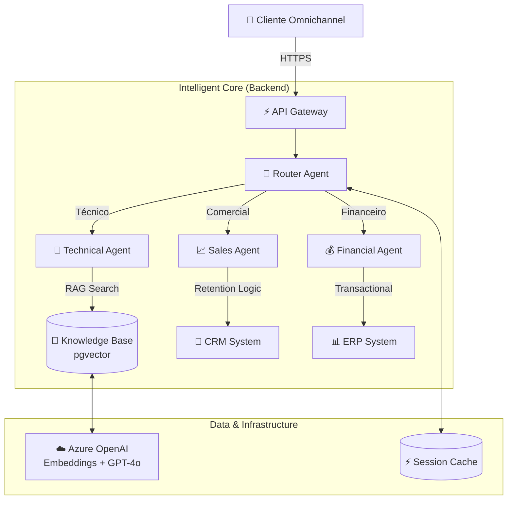

# 🏢 Central de Atendimento Inteligente | Enterprise AI Solution

<div align="center">


</div>

---

## 📋 Visão Geral Executiva

A **Central de Atendimento Inteligente** é uma plataforma de orquestração de experiências digitais baseada em Inteligência Artificial Generativa. Projetada para ambientes corporativos de alta demanda, a solução transcende os chatbots tradicionais ao implementar uma arquitetura de **Agentes Autônomos Especializados**.

Utilizando o poder do **Azure OpenAI (GPT-4o)** e **RAG (Retrieval-Augmented Generation)**, o sistema não apenas responde a perguntas, mas executa processos de negócio complexos — desde a triagem técnica avançada até negociações comerciais persuasivas e retenção de clientes.

### 🚀 Diferenciais Competitivos
*   **Hiper-Personalização**: Cada interação é contextualizada com histórico do cliente e dados de CRM.
*   **Resolução Autônoma**: Capacidade de resolver 70%+ das solicitações sem intervenção humana (Nível 1 e 2).
*   **Eficiência Operacional**: Redução drástica no TMA (Tempo Médio de Atendimento) e custos operacionais.
*   **Arquitetura Escalável**: Microsserviços assíncronos prontos para Kubernetes e Azure App Service.

---

## 🏛 Arquitetura de Solução

A plataforma adota o padrão **Multi-Agent System (MAS)**, onde um orquestrador inteligente distribui tarefas para agentes especialistas.



### Componentes Chave
1.  **Technical Agent (RAG-Powered)**: Utiliza `pgvector` para busca semântica em base de conhecimento técnica. Diagnostica falhas de internet/TV e abre chamados automaticamente.
2.  **Sales Agent (Proactive)**: Implementa lógica de vendas agressiva ("Wolf of Wall Street" persona). Realiza upgrades em tempo real e aplica estratégias de retenção com descontos dinâmicos.
3.  **Financial Agent**: Integrado ao ERP para emissão de boletos, desbloqueio em confiança e análise de faturas.

---

## 🛠 Stack Tecnológica Corporativa

### Backend & AI Core
*   **Language**: Python 3.12+ (AsyncIO)
*   **Framework**: FastAPI 0.121.2
*   **LLM Orchestration**: Semantic Kernel / Native Azure OpenAI SDK
*   **AI Models**: GPT-4o (Reasoning), GPT-4o-mini (Routing), text-embedding-3-small (Vectorization)
*   **Database**: PostgreSQL 14+ com extensão `vector` (pgvector)
*   **Cache**: Azure Redis (Session Management)

### Frontend & UX
*   **Framework**: React 19.2.0
*   **Build System**: Vite
*   **Styling**: CSS Modules (Scoped & Performant)

### DevOps & Cloud
*   **Cloud Provider**: Microsoft Azure (App Service, Database for PostgreSQL)
*   **CI/CD**: GitHub Actions (Automated Testing & Deployment)
*   **Containerization**: Docker & Docker Compose

---

## 🚀 Guia de Implantação

### Pré-requisitos
*   Docker Engine 24+
*   Azure Subscription (com OpenAI Service habilitado)

### 1. Configuração de Ambiente
Clone o repositório e configure as variáveis de ambiente:
```bash
git clone https://github.com/Jcnok/central-atendimento-azure.git
cd central-atendimento-azure
cp backend/.env.example backend/.env
```

### 2. Execução Local (Docker)
Inicie toda a stack (Frontend, Backend, Banco de Dados) com um único comando:
```bash
docker-compose up --build
```
*   **Frontend**: `http://localhost:3000`
*   **API Documentation**: `http://localhost:8000/docs`

### 3. População da Base de Conhecimento (RAG)
Para ativar a inteligência do Agente Técnico, popule o banco vetorial:
```bash
# Dentro do container ou venv
python backend/scripts/seed_knowledge_base.py
```

---

## 💼 Cenários de Negócio

### 🔧 Suporte Técnico Inteligente
> **Cliente**: "Minha internet caiu e a luz PON está piscando."
>
> **Agente Técnico**:
> 1.  Consulta a Base de Conhecimento via busca vetorial (`pgvector`).
> 2.  Identifica "Rompimento de Fibra" baseado nos sintomas.
> 3.  Verifica se já existe chamado aberto (`get_open_tickets`).
> 4.  Se não, abre um ticket prioritário e informa o SLA de 4 horas.

### 📈 Vendas e Retenção
> **Cliente**: "Quero cancelar minha assinatura."
>
> **Agente de Vendas**:
> 1.  Analisa perfil e valor do cliente.
> 2.  Aplica técnicas de contorno de objeções.
> 3.  **Cartada Final**: Oferece automaticamente 20% de desconto por 6 meses (`apply_discount`).
> 4.  Se aceito, aplica o desconto e atualiza o contrato em tempo real.

---

## 🗺 Roadmap de Evolução

*   [x] **Fase 1: Core Foundation** - Arquitetura Async, Docker, Integração Azure OpenAI.
*   [x] **Fase 2: Advanced Intelligence** - RAG com pgvector, Agentes Especialistas (Sales/Tech).
*   [ ] **Fase 3: Omnichannel Expansion** - Integração nativa com WhatsApp Business API e Teams.
*   [ ] **Fase 4: Voice Interface** - Integração com Azure Speech Services para atendimento por voz.
*   [ ] **Fase 5: Predictive Analytics** - Dashboards PowerBI para análise de sentimento e tendências.

---

## 📄 Licença e Compliance

Este software é propriedade intelectual confidencial. O uso é restrito aos termos da licença corporativa (MIT License para fins de demonstração).

<div align="center">
  <sub>Copyright © 2025 Jcnok Enterprise Solutions. All rights reserved.</sub>
</div>