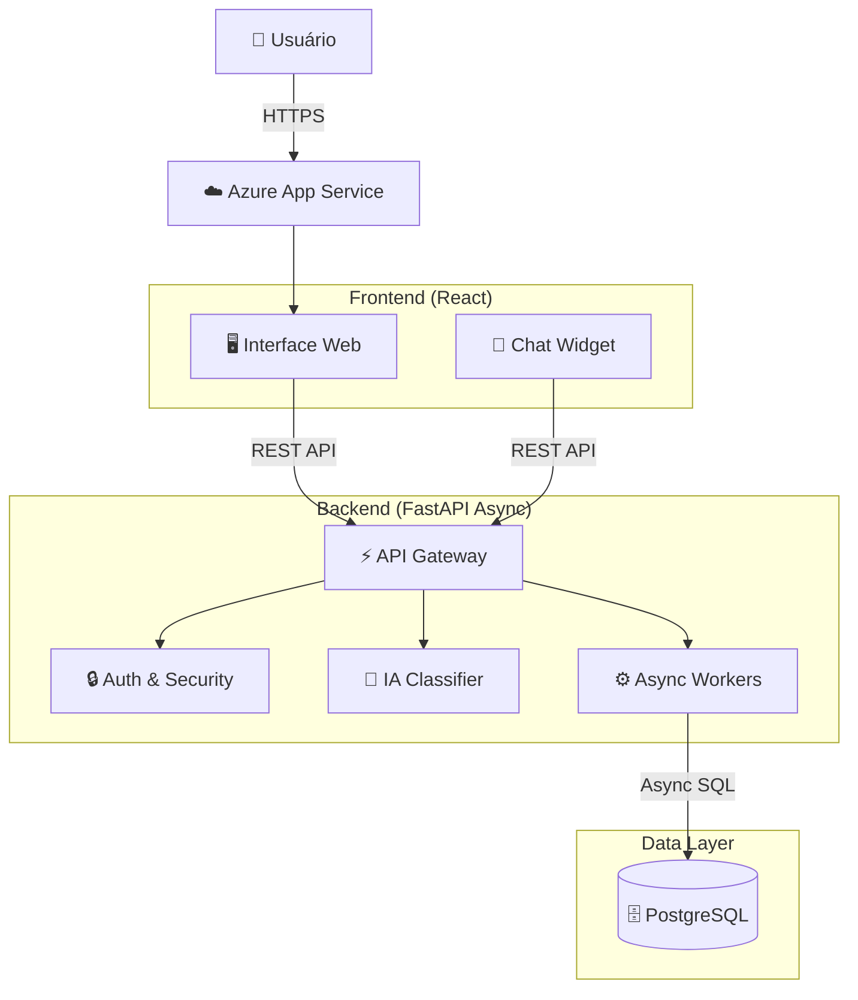

# 📘 Central de Atendimento Inteligente

<div align="center">


</div>

> *"A tecnologia é melhor quando aproxima as pessoas."* — Matt Mullenweg

---

## 📖 Índice

1. [O Problema & A Solução](#-o-problema--a-solução)
2. [Arquitetura do Sistema](#-arquitetura-do-sistema)
3. [Stack Tecnológica](#-stack-tecnológica)
4. [Guia de Início Rápido](#-guia-de-início-rápido)
5. [Estratégias de Deploy](#-estratégias-de-deploy)
6. [Casos de Uso](#-casos-de-uso)
7. [Troubleshooting](#-troubleshooting)
8. [Roadmap](#-roadmap)
9. [Contribuindo](#-contribuindo)
10. [Licença](#-licença)

---

## 🧐 O Problema & A Solução

### O Cenário
Imagine uma central de atendimento sobrecarregada. Telefones tocando incessantemente, e-mails acumulando e clientes frustrados esperando horas por uma resposta simples sobre a segunda via de um boleto. Os atendentes humanos, exaustos, gastam 80% do tempo respondendo às mesmas perguntas triviais, deixando os problemas complexos — que realmente exigem empatia e criatividade — em segundo plano.

### A Nossa Abordagem
A **Central de Atendimento Inteligente** não é apenas um chatbot; é um **orquestrador de experiências**. Ela atua como um *concierge* digital, recebendo cada solicitação, entendendo a intenção através de Inteligência Artificial e decidindo instantaneamente o melhor curso de ação.

*   **Para o trivial (ex: 2ª via de boleto):** Resolução imediata e automática. O cliente sai feliz em segundos.
*   **Para o complexo (ex: problemas técnicos):** Encaminhamento cirúrgico para o especialista humano, já com todo o contexto mastigado.

O resultado? Uma sinfonia de eficiência onde a máquina cuida da repetição e o humano cuida da relação.

---

## 🏛 Arquitetura do Sistema

Nossa arquitetura segue o padrão **Monolito Modular Moderno**, projetado para ser robusto, escalável e fácil de manter. O backend opera de forma **Assíncrona (AsyncIO)**, garantindo alta performance mesmo sob tráfego intenso.



---

## 🛠 Stack Tecnológica

### Backend (O Motor)
*   **Python 3.10+**: A linguagem da IA e da produtividade.
*   **FastAPI**: Framework moderno, rápido e assíncrono.
*   **SQLAlchemy (AsyncIO)**: ORM poderoso para interações não-bloqueantes com o banco.
*   **Pydantic**: Validação de dados robusta e tipada.

### Frontend (A Face)
*   **React 18**: Biblioteca líder para interfaces interativas.
*   **Vite**: Build tool ultrarrápida.
*   **CSS Modules**: Estilização modular e segura.

### Infraestrutura & DevOps (A Fundação)
*   **Docker**: Containerização para consistência entre ambientes.
*   **Azure App Service**: PaaS escalável para hospedagem.
*   **PostgreSQL**: Banco de dados relacional robusto.
*   **GitHub Actions**: CI/CD automatizado.

---

## 🚀 Guia de Início Rápido

### Pré-requisitos
*   Docker & Docker Compose
*   Git

### Rodando Localmente (Modo Turbo)

1.  **Clone o repositório:**
    ```bash
    git clone https://github.com/Jcnok/central-atendimento-azure.git
    cd central-atendimento-azure
    ```

2.  **Suba a aplicação com Docker Compose:**
    ```bash
    docker-compose up --build
    ```

3.  **Acesse:**
    *   Frontend: `http://localhost:3000` (ou a porta definida no compose)
    *   API Docs: `http://localhost:8000/docs`

---

## 🚢 Estratégias de Deploy

Oferecemos flexibilidade total para levar sua aplicação para o mundo.

### Opção 1: Azure App Service (Recomendado)
Nossa pipeline de CI/CD (`.github/workflows/deploy.yml`) já está configurada.
1.  Crie um App Service no Azure (Linux + Python).
2.  Configure as variáveis de ambiente (`DATABASE_URL`, `SECRET_KEY`).
3.  Obtenha o *Publish Profile* e adicione aos Secrets do GitHub (`AZURE_WEBAPP_PUBLISH_PROFILE`).
4.  Faça um push para a branch `master`. **Deploy automático!** 🪄

### Opção 2: Docker Puro
Para servidores VPS ou máquinas virtuais.
```bash
docker build -t central-atendimento .
docker run -p 8000:8000 --env-file .env central-atendimento
```

### Opção 3: Multicloud (Kubernetes/K8s)
O container é *stateless* e pronto para orquestração. Basta criar os manifestos de Deployment e Service apontando para a imagem gerada.

---

## 💡 Casos de Uso

### 1. Autoatendimento Financeiro
*   **Usuário:** "Quero a segunda via do meu boleto."
*   **Sistema:** Identifica intenção -> Valida usuário -> Gera boleto -> Envia link.
*   **Tempo:** < 5 segundos.

### 2. Triagem de Suporte Técnico
*   **Usuário:** "Meu sistema não está abrindo a tela de relatórios."
*   **Sistema:** Identifica problema técnico -> Classifica prioridade -> Cria ticket -> Encaminha para fila "Nível 2".
*   **Resultado:** O técnico recebe o chamado já classificado e o usuário recebe um protocolo imediato.

---

## 🔧 Troubleshooting

**Erro: `[Errno 111] Connect call failed` nos testes**
*   **Causa:** Tentativa de conectar ao PostgreSQL durante testes unitários.
*   **Solução:** O sistema agora usa `SQLite` em memória automaticamente para testes. Certifique-se de ter as dependências de teste instaladas.

**Erro: `ModuleNotFoundError: No module named 'asyncpg'`**
*   **Causa:** Dependência do driver assíncrono faltando.
*   **Solução:** Execute `pip install -r requirements.txt`.

---

## 🗺 Roadmap

*   [x] **Fase 1: MVP** - Backend Async, Frontend Básico, Dockerização.
*   [x] **Fase 2: Refatoração** - Migração total para AsyncIO, Melhorias de UX.
*   [ ] **Fase 3: Inteligência Real** - Integração com Azure OpenAI (GPT-4) para respostas generativas.
*   [ ] **Fase 4: Omnichannel** - Integração oficial com WhatsApp Business API.
*   [ ] **Fase 5: Analytics Avançado** - Dashboards PowerBI em tempo real.

---

## 🤝 Contribuindo

Acreditamos na força da comunidade! Para contribuir:

1.  Faça um **Fork** do projeto.
2.  Crie uma **Branch** para sua feature (`git checkout -b feature/IncrívelFeature`).
3.  Faça o **Commit** (`git commit -m 'Add: IncrívelFeature'`).
4.  Faça o **Push** (`git push origin feature/IncrívelFeature`).
5.  Abra um **Pull Request**.

> **Nota:** Por favor, garanta que os testes passem (`pytest`) antes de enviar.

---

## 📄 Licença

Este projeto está licenciado sob a licença MIT - veja o arquivo [LICENSE](LICENSE) para detalhes.

---

<div align="center">
  <sub>Desenvolvido com 💙 e muito ☕ por Jcnok</sub>
</div>