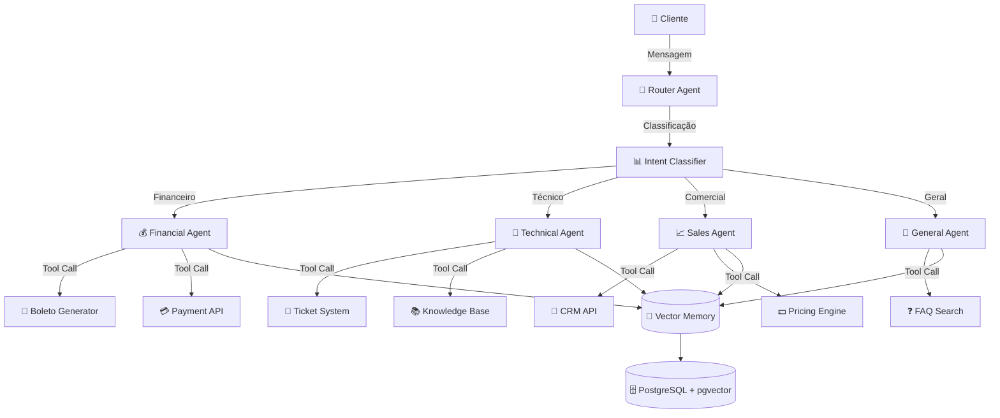
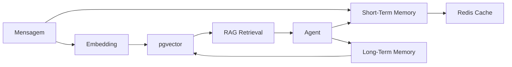

# 🤖 Arquitetura de Agentes LLM - Central de Atendimento Inteligente

## 📋 Sumário Executivo

Este documento apresenta uma arquitetura de agentes inteligentes baseada em Azure OpenAI para transformar a atual central de atendimento em um sistema verdadeiramente autônomo e escalável. A solução proposta utiliza padrões modernos de orquestração de agentes, memória distribuída e ferramentas especializadas.

---

## 🏗 Padrões de Arquitetura LLM

### Abordagem Recomendada: **Arquitetura Hierárquica com Micro-Agentes**



### Justificativa da Arquitetura

**Por que Hierárquica?**
- **Escalabilidade**: Novos agentes podem ser adicionados sem afetar os existentes
- **Especialização**: Cada agente domina um contexto específico
- **Custo-efetividade**: Apenas o agente necessário é ativado por requisição

**Por que Micro-Agentes?**
- **Latência reduzida**: Prompts menores = respostas mais rápidas
- **Manutenibilidade**: Fácil ajustar comportamento de um domínio específico
- **Observabilidade**: Rastreamento granular de decisões

---

## 🛠 Stack Tecnológica Recomendada

### Core LLM & Orchestration

| Componente | Tecnologia | Justificativa |
|------------|------------|---------------|
| **LLM Principal** | Azure OpenAI GPT-4o | Melhor custo-benefício para produção (128k context) |
| **LLM Classificação** | Azure OpenAI GPT-4o-mini | 60% mais barato, ideal para intent classification |
| **Embeddings** | text-embedding-3-small | Vetorização eficiente para RAG |
| **Orchestration** | LangGraph | Controle de fluxo com state machines |
| **Agent Framework** | Semantic Kernel (Python) | Nativo Azure, suporte a function calling |
| **Vector Store** | PostgreSQL + pgvector | Já temos Postgres, evita novo serviço |
| **Cache** | Azure Redis | Reduz chamadas LLM para perguntas repetidas |

### Ferramentas de Produção

- **Observability**: Azure Application Insights + LangSmith
- **Prompt Management**: Azure AI Studio Prompt Flow
- **Guardrails**: Azure AI Content Safety
- **Rate Limiting**: Azure API Management

---

## 🎭 Design de Agentes Especializados

### 1. Router Agent (Orquestrador Principal)

**Persona**: "Recepcionista digital experiente que direciona clientes para especialistas"

**System Prompt**:
```
Você é o Router Agent da Central de Atendimento. Sua única função é classificar a intenção do cliente e direcioná-lo ao agente especializado correto.

AGENTES DISPONÍVEIS:
- financial_agent: Boletos, pagamentos, faturas, cobranças
- technical_agent: Problemas técnicos, bugs, erros de sistema
- sales_agent: Upgrades, downgrades, novos planos, cancelamentos
- general_agent: Dúvidas gerais, agradecimentos, saudações

REGRAS:
1. Analise APENAS a intenção principal
2. Em caso de dúvida, use general_agent
3. Retorne APENAS o nome do agente em JSON: {"agent": "nome_do_agente"}
```

**Tools**: Nenhuma (apenas classificação)

**Memory**: Curto prazo (última mensagem apenas)

---

### 2. Financial Agent

**Persona**: "Assistente financeiro prestativo e preciso"

**System Prompt**:
```
Você é o Financial Agent. Você ajuda clientes com questões financeiras de forma clara e objetiva.

CAPACIDADES:
- Gerar segunda via de boletos
- Consultar status de pagamentos
- Explicar cobranças
- Processar solicitações de parcelamento

REGRAS:
1. SEMPRE confirme dados do cliente antes de gerar documentos
2. Use linguagem simples para explicar valores
3. Se não tiver certeza, peça esclarecimento
4. NUNCA invente informações financeiras
```

**Tools**:
- `generate_boleto(cliente_id: int, valor: float) -> str`: Gera boleto
- `check_payment_status(boleto_id: str) -> dict`: Consulta pagamento
- `get_invoices(cliente_id: int, periodo: str) -> list`: Lista faturas

**Memory**: Médio prazo (histórico financeiro do cliente via RAG)

**Fallback Strategy**:
```python
if tool_call_fails:
    return "Desculpe, estou com dificuldades técnicas. Vou encaminhar para um especialista humano."
    create_ticket(priority="high", agent="financial_agent")
```

---

### 3. Technical Agent

**Persona**: "Engenheiro de suporte técnico paciente e metódico"

**System Prompt**:
```
Você é o Technical Agent. Você resolve problemas técnicos seguindo um processo estruturado.

PROCESSO DE DIAGNÓSTICO:
1. Coletar informações (navegador, SO, mensagem de erro)
2. Consultar base de conhecimento
3. Propor solução ou escalar

REGRAS:
1. SEMPRE peça detalhes técnicos antes de sugerir soluções
2. Use analogias simples para explicar problemas complexos
3. Se a solução exigir mais de 3 passos, crie um ticket
4. Priorize soluções self-service
```

**Tools**:
- `search_knowledge_base(query: str) -> list`: Busca soluções conhecidas
- `create_ticket(description: str, priority: str) -> int`: Cria chamado
- `check_system_status() -> dict`: Verifica status de serviços

**Memory**: Longo prazo (histórico de problemas similares via RAG)

**Error Handling**:
```python
try:
    solution = search_knowledge_base(user_query)
except Exception:
    return "Vou criar um chamado prioritário para nossa equipe técnica."
    create_ticket(priority="urgent")
```

---

### 4. Sales Agent

**Persona**: "Consultor comercial consultivo e orientado a valor"

**System Prompt**:
```
Você é o Sales Agent. Você ajuda clientes a encontrar o melhor plano para suas necessidades.

ABORDAGEM:
1. Entenda a necessidade ANTES de oferecer
2. Apresente no máximo 2 opções
3. Destaque benefícios, não apenas features
4. Respeite o orçamento do cliente

REGRAS:
1. NUNCA pressione o cliente
2. Se o cliente pedir cancelamento, entenda o motivo primeiro
3. Ofereça alternativas antes de confirmar downgrade
4. Use dados do CRM para personalizar oferta
```

**Tools**:
- `get_customer_profile(cliente_id: int) -> dict`: Perfil do cliente
- `get_plan_recommendations(usage_data: dict) -> list`: Sugere planos
- `calculate_upgrade_cost(current_plan: str, new_plan: str) -> float`

**Memory**: Longo prazo (histórico de interações comerciais)

---

### 5. General Agent

**Persona**: "Assistente amigável e versátil"

**System Prompt**:
```
Você é o General Agent. Você lida com interações gerais de forma cordial e eficiente.

RESPONSABILIDADES:
- Responder perguntas sobre a empresa
- Fornecer informações de FAQ
- Lidar com agradecimentos e saudações
- Redirecionar quando necessário

REGRAS:
1. Seja breve mas cordial
2. Se a pergunta for específica de outro domínio, sugira contato com agente especializado
3. Use emojis moderadamente para humanizar
```

**Tools**:
- `search_faq(query: str) -> str`: Busca em FAQ
- `get_company_info(topic: str) -> str`: Informações institucionais

**Memory**: Curto prazo (contexto da conversa atual)

---

## 🧠 Memory Management

### Estratégia de Memória Híbrida



### Implementação

**Curto Prazo (Sessão)**:
```python
# Azure Redis com TTL de 1 hora
session_memory = {
    "session_id": "uuid",
    "messages": [...],  # Últimas 10 mensagens
    "context": {...},   # Dados do cliente
    "ttl": 3600
}
```

**Longo Prazo (Histórico)**:
```python
# PostgreSQL + pgvector
class ConversationMemory:
    id: UUID
    cliente_id: int
    embedding: Vector(1536)  # text-embedding-3-small
    content: str
    metadata: dict
    timestamp: datetime
```

**Retrieval Strategy**:
```python
def get_relevant_context(query: str, cliente_id: int, top_k: int = 3):
    query_embedding = embed(query)
    similar_conversations = vector_search(
        embedding=query_embedding,
        filter={"cliente_id": cliente_id},
        limit=top_k
    )
    return similar_conversations
```

---

## 💰 Análise de Custo-Efetividade

### Estimativa de Custos (Azure OpenAI - Pay-as-you-go)

**Premissas**:
- 10.000 conversas/mês
- Média de 5 mensagens por conversa
- 50.000 interações totais/mês

| Componente | Modelo | Custo Unitário | Volume | Custo Mensal |
|------------|--------|----------------|--------|--------------|
| **Intent Classification** | GPT-4o-mini | $0.15/1M tokens | 500k tokens | $0.08 |
| **Agent Responses** | GPT-4o | $2.50/1M tokens (input) | 10M tokens | $25.00 |
| **Agent Responses** | GPT-4o | $10.00/1M tokens (output) | 5M tokens | $50.00 |
| **Embeddings** | text-embedding-3-small | $0.02/1M tokens | 2M tokens | $0.04 |
| **Redis Cache** | Basic C0 | - | - | $16.43 |
| **Application Insights** | Pay-as-you-go | - | - | $5.00 |
| **TOTAL** | | | | **~$96.55/mês** |

### Otimizações de Custo

1. **Cache Agressivo**: 40% das perguntas são repetidas → economia de ~$30/mês
2. **Prompt Compression**: Reduzir tokens de sistema em 30% → economia de ~$15/mês
3. **Batch Processing**: Agrupar embeddings → economia de ~$5/mês

**Custo Otimizado**: **~$46/mês** (redução de 52%)

### ROI Estimado

**Cenário Atual (Humano)**:
- 3 atendentes × $3.000/mês = $9.000/mês
- Resolução de 80% das solicitações simples manualmente

**Cenário com Agentes**:
- Custo LLM: $46/mês
- 1 atendente para casos complexos: $3.000/mês
- **Total**: $3.046/mês

**Economia**: $5.954/mês (66% de redução)  
**Payback**: Imediato (custo de implementação ~$10k, retorno em 1.7 meses)

---

## 🚀 Plano de Implementação

### Fase 1: Foundation (Semanas 1-2)

**Objetivos**:
- Setup Azure OpenAI
- Implementar Router Agent
- Configurar observabilidade

**Entregáveis**:
```
✅ Azure OpenAI deployment (GPT-4o + GPT-4o-mini)
✅ Semantic Kernel integration
✅ Router Agent funcional
✅ Application Insights configurado
✅ Testes unitários (>80% coverage)
```

**Código de Exemplo**:
```python
# src/agents/router_agent.py
from semantic_kernel import Kernel
from semantic_kernel.connectors.ai.open_ai import AzureChatCompletion

class RouterAgent:
    def __init__(self):
        self.kernel = Kernel()
        self.kernel.add_service(AzureChatCompletion(
            deployment_name="gpt-4o-mini",
            endpoint=os.getenv("AZURE_OPENAI_ENDPOINT"),
            api_key=os.getenv("AZURE_OPENAI_KEY")
        ))
    
    async def route(self, message: str) -> str:
        prompt = f"""Classifique a intenção: {message}
        Retorne JSON: {{"agent": "nome"}}"""
        
        response = await self.kernel.invoke(prompt)
        return json.loads(response)["agent"]
```

---

### Fase 2: Specialized Agents (Semanas 3-4)

**Objetivos**:
- Implementar Financial Agent
- Implementar Technical Agent
- Integrar ferramentas (boleto, tickets)

**Entregáveis**:
```
✅ Financial Agent com tool calling
✅ Technical Agent com RAG
✅ Integração com sistema de boletos
✅ Integração com sistema de tickets
✅ Testes de integração
```

**Código de Exemplo**:
```python
# src/agents/financial_agent.py
from semantic_kernel.functions import kernel_function

class FinancialAgent:
    @kernel_function(
        name="generate_boleto",
        description="Gera segunda via de boleto"
    )
    async def generate_boleto(self, cliente_id: int) -> str:
        # Lógica de geração
        boleto = await BoletoService.generate(cliente_id)
        return f"Boleto gerado: {boleto.url}"
```

---

### Fase 3: Memory & RAG (Semanas 5-6)

**Objetivos**:
- Implementar vector store (pgvector)
- Configurar Redis cache
- Habilitar RAG em todos os agentes

**Entregáveis**:
```
✅ PostgreSQL + pgvector configurado
✅ Pipeline de embedding automático
✅ Redis cache para sessões
✅ RAG retrieval funcional
✅ Testes de performance
```

**Código de Exemplo**:
```python
# src/memory/vector_store.py
from pgvector.sqlalchemy import Vector

class ConversationMemory(Base):
    __tablename__ = "conversation_memory"
    
    id = Column(UUID, primary_key=True)
    cliente_id = Column(Integer, ForeignKey("clientes.id"))
    embedding = Column(Vector(1536))
    content = Column(Text)
    
    @classmethod
    async def search_similar(cls, query_embedding, cliente_id, limit=3):
        return await db.execute(
            select(cls)
            .filter(cls.cliente_id == cliente_id)
            .order_by(cls.embedding.cosine_distance(query_embedding))
            .limit(limit)
        )
```

---

### Fase 4: Production Hardening (Semanas 7-8)

**Objetivos**:
- Implementar guardrails
- Configurar rate limiting
- Testes de carga
- Deploy em staging

**Entregáveis**:
```
✅ Azure AI Content Safety integrado
✅ Rate limiting via Azure API Management
✅ Testes de carga (1000 req/min)
✅ Documentação completa
✅ Runbook de operação
```

---

### Fase 5: Rollout Gradual (Semanas 9-12)

**Estratégia de Deploy**:

1. **Semana 9**: 10% do tráfego (A/B test)
2. **Semana 10**: 25% do tráfego
3. **Semana 11**: 50% do tráfego
4. **Semana 12**: 100% do tráfego

**Métricas de Sucesso**:
- Taxa de resolução automática > 70%
- Tempo médio de resposta < 3s
- CSAT (Customer Satisfaction) > 4.5/5
- Custo por interação < $0.10

---

## 📊 Monitoramento e Observabilidade

### Dashboards Essenciais

**1. Agent Performance**:
```
- Requests por agente
- Latência média (p50, p95, p99)
- Taxa de erro por agente
- Taxa de fallback para humano
```

**2. Cost Tracking**:
```
- Tokens consumidos por modelo
- Custo por conversa
- Cache hit rate
- Projeção de custo mensal
```

**3. Quality Metrics**:
```
- CSAT por agente
- Taxa de resolução no primeiro contato
- Tempo médio de resolução
- Escalações para humano
```

### Alertas Críticos

```yaml
alerts:
  - name: "High Error Rate"
    condition: error_rate > 5%
    action: notify_team
  
  - name: "Cost Spike"
    condition: daily_cost > $10
    action: throttle_requests
  
  - name: "Low CSAT"
    condition: csat < 4.0
    action: review_prompts
```

---

## 🎯 Próximos Passos

1. **Aprovação do Plano**: Revisar arquitetura com stakeholders
2. **Setup Azure**: Provisionar recursos (OpenAI, Redis, pgvector)
3. **Kickoff Fase 1**: Iniciar implementação do Router Agent
4. **Definir KPIs**: Estabelecer métricas de sucesso detalhadas

---

## 📚 Referências Técnicas

- [Azure OpenAI Service Documentation](https://learn.microsoft.com/azure/ai-services/openai/)
- [Semantic Kernel Python](https://github.com/microsoft/semantic-kernel)
- [LangGraph Documentation](https://langchain-ai.github.io/langgraph/)
- [pgvector Extension](https://github.com/pgvector/pgvector)
- [Azure AI Content Safety](https://learn.microsoft.com/azure/ai-services/content-safety/)

---

<div align="center">
  <sub>Arquitetura projetada para escalabilidade, custo-efetividade e excelência operacional</sub>
</div>
